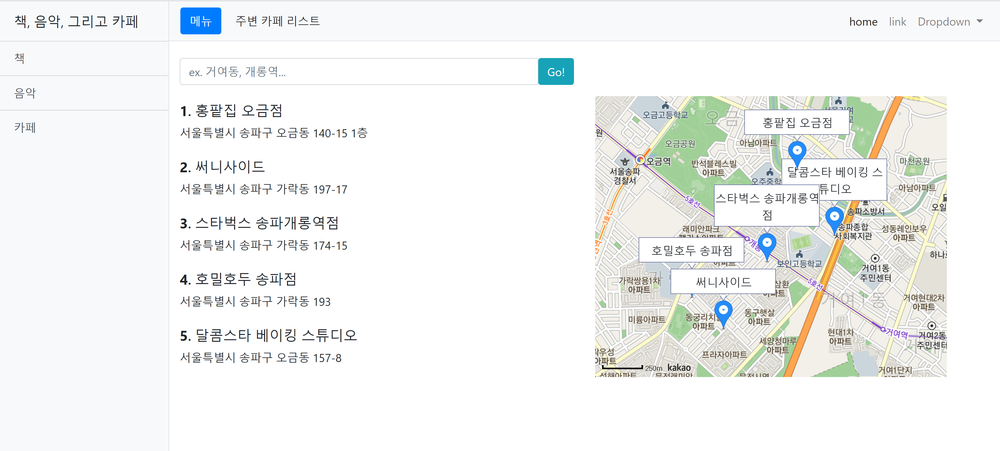

# book_music_cafe

책, 음악, 카페에 대한 주제로 크롤링과 API 사용 연습을 위한 웹사이트

* Book - 베스트셀러 Top 20
* Music - Global Top 20
* Cafe - 사용자 위치 근처의 인기있는 카페 리스트업
* slack bot - Ranking changed 알리미

다양한 라이브러리와 api를 사용해보는 것이 목표

## I use..

* bs4, BeautifulSoup4 - for crawling
* Spotipy - python library for the Spotify web api
* Django - web application framework
* NAVER search api - 사용자가 입력한 위치 근처 카페 리스트업
* Kakao map api - 카페 위치 지도
* slacker - Full-featured Python interface for the Slack API

## Top20 Bestseller Book in Kyobo

## Top20 Global music in Spotify

## nearby 5 popular cafe list

